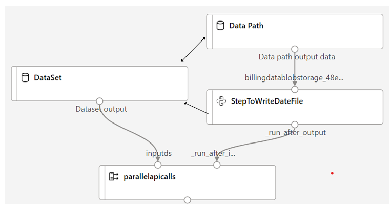
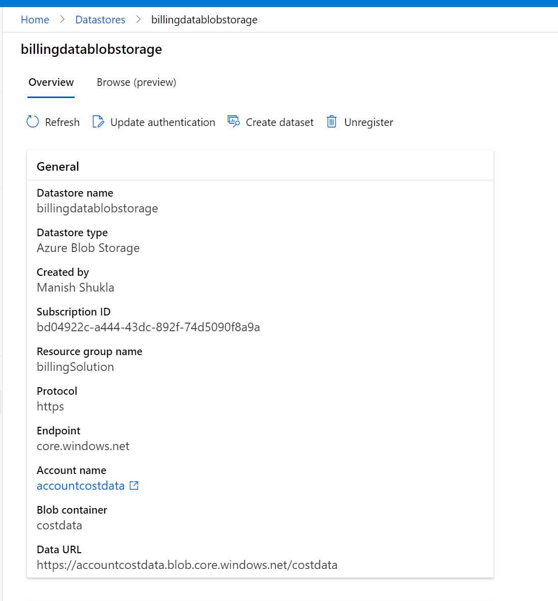
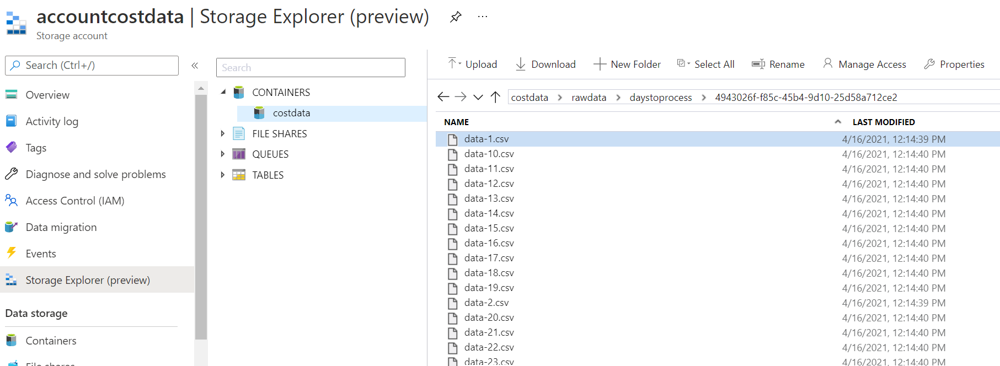

# ForecastAML
This repo will contain some code that shows how AML can be used to set up data ingestion in parallel and then do forecast based on rolling window of time.

## Data Ingestion

1. When data is pulled from an external sourcee. (e.g. Billing API in this case), you could parallelize the data pulling process using ParallelRunStep available in AML sdk. 
2. You will have to shard the data pulling parameters in such a way that no two api pull results in same data. 
3. The first step in the pipeline creates the parameters and puts them in a seperate files and puts those files into a storage location. The storage location is passed using datapath in a pipeline parameter.
4. Once the first step is run, parallelruntask then runs and uses the files produced in first step as mini batches.

### Overview of AML pipeline:

Pipeline looks like the below diagram:

Datastore registration:

Mini batch files:

